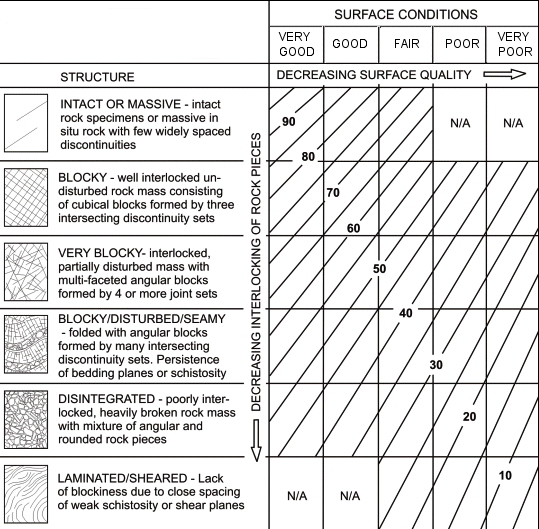

```{r setup, include=FALSE}
library(GMisc)
library(tidyverse)

load('../inst/HB_D.rda')
load('../inst/HB_mi_mr.rda')
load('../inst/HB_sig_ci.rda')

knitr::opts_chunk$set(
  echo = TRUE,
  message = FALSE,
  warning = FALSE,
  error = FALSE,
  fig.align = "center",
  out.width = "80%"
)
```

This document highlights some functions of the GMisc package related to rock mechanics problems.

# Uniaxial Compressive Strength (UCS)

The UCS is one of the parameters needed to classify the rock mass using Hoek-Brown. There are different ways to obtain this parameter but one simple and cost effective solution is the Point Load Test (PLT). In this test several irregular samples are measured (width and diameter) and their strength is tested using the PLT machine. Afterwards, these data can be analyzed to obtain the $I_{50}$ and the respective UCS.

The function `UCS` of the package performs the conventional analysis through a classical (Gaussian) regression of the failure load with respect to the equivalent diameter (calculated from the width and diameter of the irregular samples), and predicting the load and $I_{50}$ for the classical 50 mm cylinder. The function goes beyond and performs a robust regression to account for outliers, as well as estimating an $I_{50}$ for each sample and estimating the mean and median of this value (corrected mean and median).

The arguments for `UCS` are `W` for the widths in millimeters, `D` for the diameter in millimeters, and `P` for the failure load. Also a vertical dashed line is shown at the 50 mm diameter, as this is the reference diameter.

```{r warning=FALSE, message=FALSE}
W = c(70.0,95.0,80.0,90.0,98.0,110.0,100.0,100.0,110.0)
D = c(40,55,60,50,25,60,40,70,50)
P = c(4.3,3.4,4.5,3.1,5.0,6.4,2.6,11,4.1)
UCS(W = W, D = D, P = P)
```

This result could be compared against different methods and a more informative can be made regarding the election of the UCS for the rock mass.

# Hoek-Brown

This criterion is used to estimate the mechanical behavior of rock masses (taking in consideration both intact rock and discontinuities) along with strength and deformation parameters. The results are useful to be used in computer models.

The general for of the criterion is:

$$
\sigma_1 = \sigma_3 + \sigma_{ci} \left( m_b \frac{\sigma_3}{\sigma_{ci}} +s \right)^a
$$

where $\sigma_{ci}$ is the compressive strength of the intact rock, $m_b$, $a$, and $s$ are material constants.

The discontinuities, geological structures, and general state of the rock mass is assessed and considered through the Geological Strength Index (GSI). Two cases are available, one for a general scenario and one for a flysch scenario.

General GSI

```{r echo=F, out.width='50%'}

```

Flysch GSI

```{r echo=F, out.width='50%'}
knitr::include_graphics('../inst/GSI_flysch.PNG')
```

To use this criterion there are two functions `Hoek_Brown` and `Hoek_Brown_plot`. The first one calculates the criterion and the second one plots the results from the first one. The arguments are: `sig.ci` the uniaxial compressive strength of the intact rock in MPa, `GSI`, `mi` the intact rock constant, `MR` the modulus ratio, `D` the quality of the explosive campaign design, `unit.weight` in $kN/m^3$, `height`, in meters, to which calculate the stress level, and `use` the expected use for the rock mass ("general", "tunnels", or "slopes").

Some of these inputs can be obtained from the following tables, where in most cases are rock type dependent.

```{r echo=FALSE}
DT::datatable(HB_sig_ci,
              rownames=FALSE, options = list(dom='t'),
              caption="Table 1: Intact Uniaxial Compressive Strength"
              )

DT::datatable(HB_mi_MR,
              rownames=FALSE, filter="top",
              caption="Table 2: mi & MR values for different rocks",
              colnames = c('Modulus Ratio (MR)' = 'MR')
      )

DT::datatable(HB_D,
              rownames=FALSE, options = list(dom='t'),
              caption="Table 3: Disturbance Factor",
              colnames = c('Use' = 'Application')
      )
```


```{r}
sig.ci = 16
GSI = 75
mi = 13
MR = 300
D = 0
height = 40
unit.weight = 18.6
HB = Hoek_Brown(sig.ci, GSI, mi, MR, D, height, unit.weight)
HB %>% 
  pluck('Results') %>% 
  as.data.frame()
```

The results display the input parameters as well as the estimated strength and deformation parameters (in MPa). The `phi.h` and `c.h` are the strength parameters for the stress level.

```{r}
Hoek_Brown_plot(HB)
```

The plotting function shows two graphs, one in terms of the major and minor principal stresses, and one in terms of the normal and shear stresses. The second one shows the linear fit for the desired stress level, along with the parameters of cohesion ($c$) and friction angle ($\phi$) for the whole rock mass and for the desired stress level.

# Q

The function `Q_93` is very simple in the way that it plots the $Q$ parameter for the given equivalent diameter on top of the Q-diagram to determine the quality of the rock mass and the needed support.

The arguments are `De` for the equivalent diameter, and `Q`. The amount of points have to be same in both vectors, or one can be a unique value and it will be assigned to all the values of the other.

In this example different values of `Q` are plotted for a single value of `De`, giving different classifications for some of the points.

```{r warning=FALSE, message=FALSE}
De = 9
Q = c(.026, 1.4, .078, .56, .35)
Q_93(Q, De)
```

# Barton-Choubey

This criterion estimates the strength parameters for discontinuities (fractures, bedding planes, etc.) and has the following form:

$$
\tau = \sigma'_n tan \left[ JRC \ log_{10} \left(\frac{JCS}{\sigma'_n} \right) + \phi_r \right]
$$
where $\tau$ and $\sigma$ are the shear and normal stress on the discontinuity plane, $JRC$ is the joint roughness coefficient, $JCS$ is the joint compressive strength, and $\phi_r$ is the residual friction angle of the rock mass.

The $JRC$ can be estimated using:

```{r echo=F, out.width='50%'}
knitr::include_graphics('../inst/JRC.png')
```

while the $JCS$ (in MPa) can be calculated using:

$$JCS = 10^{0.00088 \ \gamma_{rock} \ r \ + 1.01}$$

where $r$ is the Schmidt hammer's rebound on the wall of the joint and $\gamma_{rock}$ is the unit weight of the rock in $kN/m^3$

To use this criterion there are two functions `Barton_Choubey` and `Barton_Choubey_plot`. The first one calculates the criterion and the second one plots the results from the first one. The arguments are: `JRC`, `JCS` in MPa, `phi.r` in degrees, `unit.weight` in $kN/m^3$, and the `depth`, in meters, to which calculate the stress level.

```{r}
JRC = 10
JCS = 30
phi.r = 26
unit.weight = 18.6
depth = 40
BC = Barton_Choubey(JRC, JCS, phi.r, unit.weight, depth)
BC$parameters
Barton_Choubey_plot(BC, units = 'MPa')
```

The results display the strength parameters, and the plot shows the general criterion (red) and a fit for the desired stress level (blue), and also the parameters of cohesion ($c$) and friction angle ($\phi$).

# Shinyapp

A shinyapp using some these functions can be accessed at https://maximiliano-01.shinyapps.io/rock_mechanics/.
